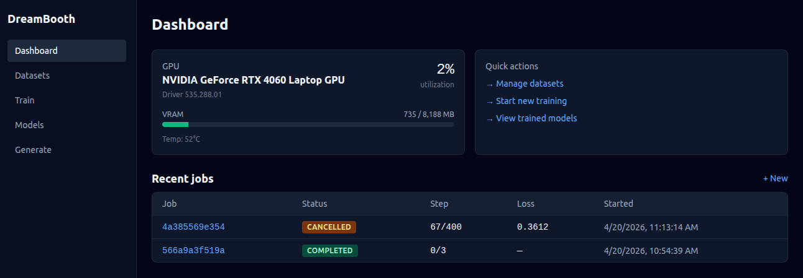

# DreamBooth Web App (RTX 4060 8GB)

8GB VRAM에 맞춰 튜닝된 DreamBooth fine-tuning 웹 애플리케이션입니다.
FastAPI 백엔드 + React(Vite + TS) 프런트엔드로 데이터셋 관리, 학습
시작/모니터링, 학습된 모델 기반 이미지 생성을 모두 브라우저에서 할 수
있습니다.



## 구성 요소

```
dreambooth_project/
├── backend/
│   ├── config.py, model.py, trainer.py, dataset.py, utils.py, main.py
│   │                                    # 학습/추론 코어 (CLI 호환)
│   └── api/
│       ├── app.py                       # FastAPI app factory + lifespan
│       ├── settings.py                  # 경로/환경 설정 (torch 미포함)
│       ├── gpu.py                       # pynvml GPU 상태
│       ├── paths.py                     # 경로 안전 유틸
│       ├── state.py                     # state.json 원자적 저장
│       ├── event_log.py                 # JSONL tail → SSE 프레임
│       ├── concurrency.py               # GPU 동시성 가드 (409)
│       ├── job_manager.py               # 학습 subprocess 관리자
│       ├── inference_manager.py         # 추론 subprocess 관리자
│       ├── schemas.py                   # Pydantic 요청/응답 스키마
│       ├── workers/
│       │   ├── train_worker.py          # 학습 서브프로세스 엔트리
│       │   └── infer_worker.py          # 추론 서브프로세스 엔트리
│       └── routes/
│           ├── health.py, gpu.py,
│           ├── datasets.py, train.py,
│           └── models.py, inference.py  # /api/* 라우터
├── frontend/                            # Vite + React 18 + TypeScript + Tailwind
│   └── src/
│       ├── pages/                       # Dashboard, Datasets, TrainNew,
│       │                                # TrainLive, Models, Generate
│       ├── components/                  # GpuStatusCard, JobStatusBadge, LossChart
│       ├── hooks/useSSE.ts              # SSE 구독 커스텀 훅
│       ├── api.ts, types.ts             # 백엔드 클라이언트/타입
│       └── App.tsx, main.tsx, index.css
├── scripts/
│   ├── dev.sh                           # backend + frontend 동시 실행
│   ├── dev_backend.sh                   # uvicorn --reload (py310_pt env)
│   └── dev_frontend.sh                  # vite dev
├── docs/
│   ├── architecture.md                  # 레이어/플로우/설계 결정
│   └── uml.md                           # Mermaid 클래스/시퀀스/상태 다이어그램
└── README.md
```

아키텍처와 UML 다이어그램은 [`docs/architecture.md`](docs/architecture.md) /
[`docs/uml.md`](docs/uml.md)를 참고하세요.

## 아키텍처

- **API 프로세스는 torch를 import하지 않습니다.** 모든 GPU 작업은
  `backend.api.workers.*` 서브프로세스로 분리되어, GPU를 한 번에 한
  프로세스만 소유합니다 (8GB에서 OOM 방지).
- 학습/추론 진행 상황은 워커가 `events.jsonl`에 append-only로 기록하고,
  API가 tailing하여 `/api/.../events` SSE 스트림으로 그대로 전달합니다.
- Job 상태는 `api/data/jobs/<id>/state.json`에 atomic write
  (tempfile → fsync → `os.replace`) 방식으로 저장됩니다.
- 서버 시작 시 `JobManager.reconcile_on_startup()`이 이전에 running으로
  남은 job들을 복구/정리하고, 백그라운드 reaper가 2초 주기로 종료된
  프로세스의 상태를 최신화합니다.
- 학습이 끝난 job의 `output/` 디렉토리가 곧 "모델"입니다. LoRA는
  `pytorch_lora_weights.bin`, 풀 파이프라인은 `model_index.json`으로
  구분합니다.

## 사전 준비

```bash
# conda 환경 (권장)
conda create -n py310_pt python=3.10
conda activate py310_pt

# 학습/추론용 파이썬 패키지
pip install torch torchvision --index-url https://download.pytorch.org/whl/cu118
pip install diffusers transformers accelerate peft bitsandbytes
pip install fastapi "uvicorn[standard]" pydantic pynvml
pip install Pillow

# 프런트엔드
cd frontend && npm install && cd ..
```

전체 학습 코어의 의존성 목록은 `backend/requirements.txt`를 참고하세요.

## 실행 방법

### 개발 모드 (두 서버 동시)

```bash
./scripts/dev.sh
# → [api] uvicorn  http://127.0.0.1:8765
# → [web] vite     http://127.0.0.1:5173
```

별도로 실행하고 싶으면:

```bash
./scripts/dev_backend.sh    # 백엔드만 (py310_pt conda env 자동 activate)
./scripts/dev_frontend.sh   # 프런트엔드만
```

Vite 설정에서 `/api`가 백엔드로 프록시되므로 브라우저는 `5173`만 열면 됩니다.

### 환경 변수

| 변수 | 기본값 | 설명 |
|------|-------|------|
| `DREAMBOOTH_CONDA_ENV` | `py310_pt` | `dev_backend.sh`가 activate할 conda env |
| `DREAMBOOTH_API_HOST` | `127.0.0.1` | uvicorn bind host |
| `DREAMBOOTH_API_PORT` | `8765` | uvicorn bind port |
| `DREAMBOOTH_API_DATA_ROOT` | `backend/api/data` | job / dataset / inference 상태 저장 경로 |
| `DREAMBOOTH_DEFAULT_PRETRAINED` | `CompVis/stable-diffusion-v1-4` | 기본 베이스 모델 |
| `DREAMBOOTH_CORS_ORIGINS` | `http://localhost:5173,http://127.0.0.1:5173` | 허용할 Origin (쉼표 구분) |
| `DREAMBOOTH_MAX_UPLOAD_BYTES` | `52428800` (50MB) | 업로드 파일당 최대 크기 |
| `DREAMBOOTH_ENABLE_XFORMERS` | `0` | 워커에서 xformers 우회 여부 (0 = 우회) |

## API 요약

| Method | Path | 설명 |
|--------|------|------|
| `GET` | `/api/health` | 헬스 체크 |
| `GET` | `/api/gpu` | GPU 상태 (pynvml) |
| `GET` | `/api/datasets` | 데이터셋 목록 |
| `POST` | `/api/datasets` (form: `name`) | 데이터셋 생성 |
| `GET` | `/api/datasets/{id}` | 데이터셋 정보 |
| `POST` | `/api/datasets/{id}/images` (multipart) | 이미지 업로드 |
| `DELETE` | `/api/datasets/{id}` | 데이터셋 삭제 |
| `POST` | `/api/train` | 학습 시작 (`TrainStartRequest`) |
| `GET` | `/api/train` | 학습 작업 목록 |
| `GET` | `/api/train/{id}` | 학습 상태 |
| `GET` | `/api/train/{id}/events` | 학습 진행 SSE |
| `POST` | `/api/train/{id}/stop` | 학습 중단 |
| `DELETE` | `/api/train/{id}` | 학습 결과 삭제 (running이면 거부) |
| `GET` | `/api/models` | 완료된 모델 목록 (LoRA / full 자동 판별) |
| `POST` | `/api/inference/generate` | 이미지 생성 시작 (`InferRequest`) |
| `GET` | `/api/inference` | 추론 작업 목록 |
| `GET` | `/api/inference/{id}` | 추론 상태 |
| `GET` | `/api/inference/{id}/events` | 추론 진행 SSE |
| `POST` | `/api/inference/{id}/stop` | 추론 중단 |
| `DELETE` | `/api/inference/{id}` | 추론 결과 삭제 |
| `GET` | `/api/inference/{id}/images/{filename}` | 생성된 이미지 파일 |

학습 또는 추론이 이미 돌고 있으면 두 번째 요청은 `409 Conflict`로 거절됩니다 (GPU 동시성 가드).

### 주요 요청 스키마

**`TrainStartRequest`** (`backend/api/schemas.py`)

| 필드 | 타입 / 기본값 | 비고 |
|------|---------------|------|
| `dataset_id` | `str` (필수) | `/api/datasets`에서 생성된 id |
| `preset` | `person` / `object` / `style` / `fast` / `high_quality` | 기본 `person` |
| `instance_prompt` | `str` | 기본 `"a photo of sks person"` |
| `class_prompt` | `str?` | `with_prior_preservation=true`일 때 필수 |
| `max_train_steps` | `int` (1~5000) | 기본 `400` (preset 기본값 자동 적용) |
| `learning_rate` | `float` (0 < x ≤ 1e-3) | 기본 `1e-6` |
| `resolution` | `int` (64~1024, 8의 배수) | 기본 `512` |
| `use_lora` | `bool` | 기본 `true` |
| `lora_rank` / `lora_alpha` | `int` (1~128) | 기본 각각 `4` |
| `mixed_precision` | `no` / `fp16` / `bf16` | 기본 `fp16` |
| `enable_vae_slicing` / `enable_vae_tiling` | `bool` | 기본 `true` / `false` |
| `cpu_offload_text_encoder` | `bool` | 기본 `false` |
| `with_prior_preservation` | `bool` | 기본 `false` |
| `seed` | `int` | 기본 `42` |
| `deterministic` | `bool` | 기본 `false` |
| `pretrained_model_name_or_path` | `str?` | 미지정 시 `DREAMBOOTH_DEFAULT_PRETRAINED` |

**`InferRequest`**

| 필드 | 타입 / 기본값 | 비고 |
|------|---------------|------|
| `model_id` | `str` (필수) | `/api/models`의 모델 id |
| `prompts` | `str[]` (1~8개) | 빈 문자열 불가 |
| `negative_prompt` | `str?` | |
| `num_inference_steps` | `int` (1~150) | 기본 `30` |
| `guidance_scale` | `float` (0~30) | 기본 `7.5` |
| `height` / `width` | `int` (64~1024, 8의 배수) | 기본 `512` |
| `num_images_per_prompt` | `int` (1~4) | 기본 `1` |
| `seed` | `int?` | |

## 웹 UI 흐름

1. **Dashboard** — GPU 상태 카드와 최근 job 요약.
2. **Datasets** — 데이터셋 생성 → 인물/객체 사진 업로드 (최소 3장 필요).
3. **Train** — 데이터셋 선택, prompt/preset/스텝/LoRA 옵션 지정 후 Start.
4. **TrainLive** — 실시간 step/loss/ETA + loss 차트(recharts) + SSE 이벤트 로그.
5. **Models** — 완료된 학습 결과 목록. LoRA / full kind 자동 표시.
6. **Generate** — 모델 선택 → 프롬프트 입력 → SSE로 이미지를 하나씩 렌더링.

## CLI (선택)

API 서버 없이 단독 실행하는 기존 CLI도 그대로 사용할 수 있습니다.

```bash
cd backend
python main.py --mode train --preset person --use_lora -y
python main.py --mode test  --test_model_path ./dreambooth_output \
    --test_prompts "a photo of sks person" "sks person wearing a suit"
```

## 8GB VRAM 팁

- LoRA는 API/웹 UI 기준 기본 ON입니다. 더 절약하려면 `cpu_offload_text_encoder=true`.
- `mixed_precision=fp16`, `enable_vae_slicing=true`, `gradient_checkpointing` + `use_8bit_adam`이 기본값입니다.
- 학습과 추론을 **동시에** 돌리지 마세요 (API가 409로 막습니다).
- 해상도를 256으로 내리면 학습·추론 모두 크게 빨라집니다.

## 트러블슈팅

| 증상 | 원인 / 해결 |
|------|------------|
| `torch.backends.cuda has no attribute is_flash_attention_available` | xformers / torch 버전 불일치 — 워커는 기본적으로 xformers를 우회합니다. 명시적으로 켜려면 `DREAMBOOTH_ENABLE_XFORMERS=1`. |
| SSE가 갑자기 끊김 | 학습이 끝나 stream이 정상 종료된 상태입니다. 다시 구독하려면 페이지 새로고침. |
| `GPU busy: ... is running` (409) | 이미 돌고 있는 학습/추론 작업을 먼저 중단하세요. |
| 업로드 skipped | 확장자 제한(`png/jpg/jpeg/bmp/tiff/webp`) 또는 파일명 규칙(`^[A-Za-z0-9][A-Za-z0-9._-]{0,127}$`) 위반. |
| `dataset has N images; need at least 3` | DreamBooth에는 최소 3장 이상이 필요합니다. |
| `resolution must be a multiple of 8` / `height and width must be multiples of 8` | 8의 배수로 조정. |

## 라이선스

MIT (`LICENSE` 참고). `CompVis/stable-diffusion-v1-4`는 각자의 체크포인트
라이선스를 따릅니다.
