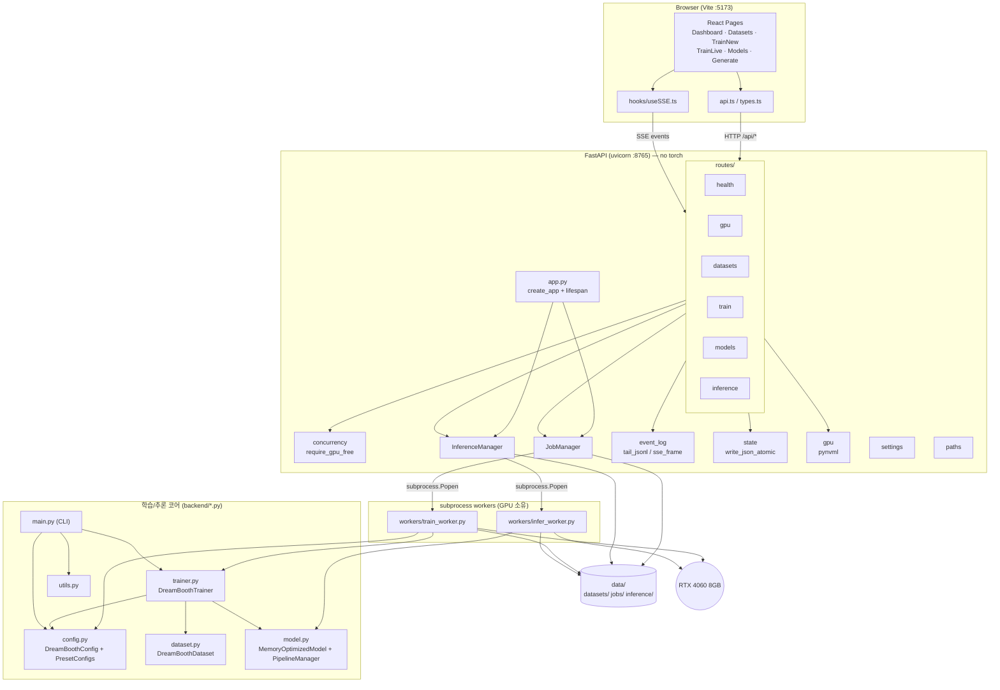
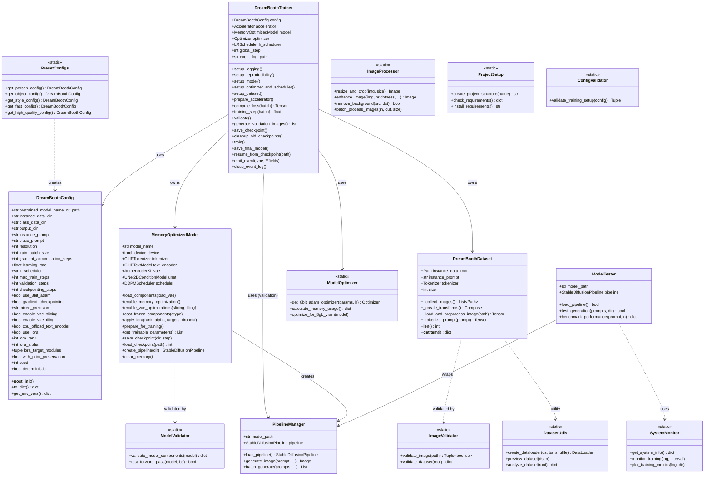
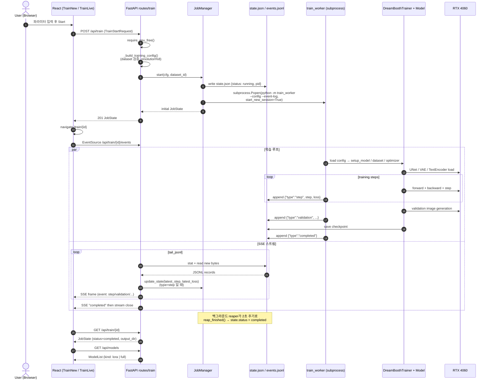
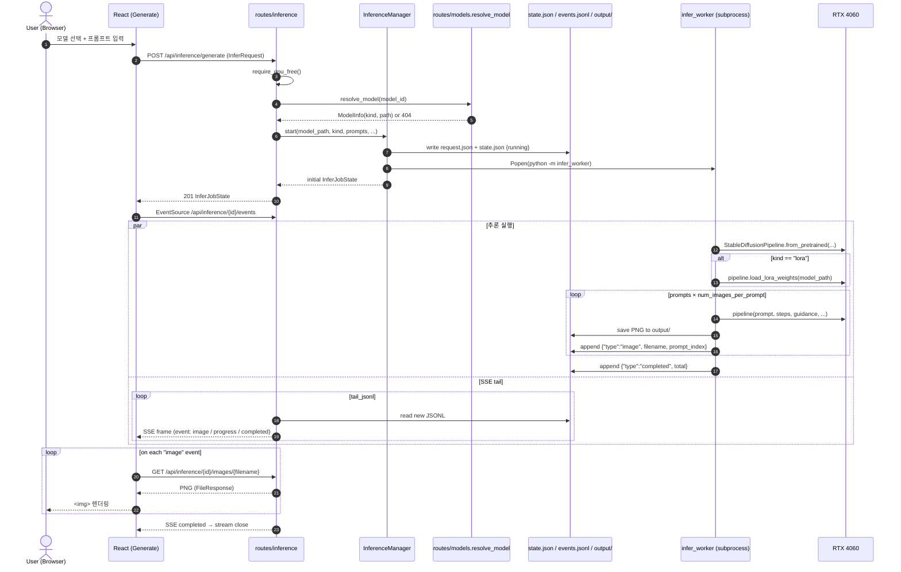
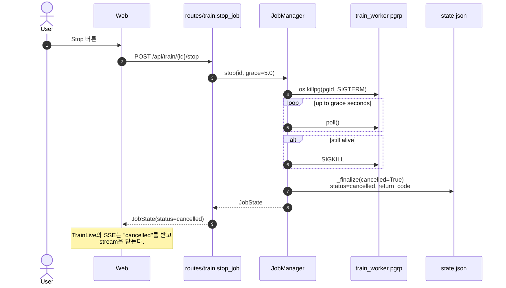
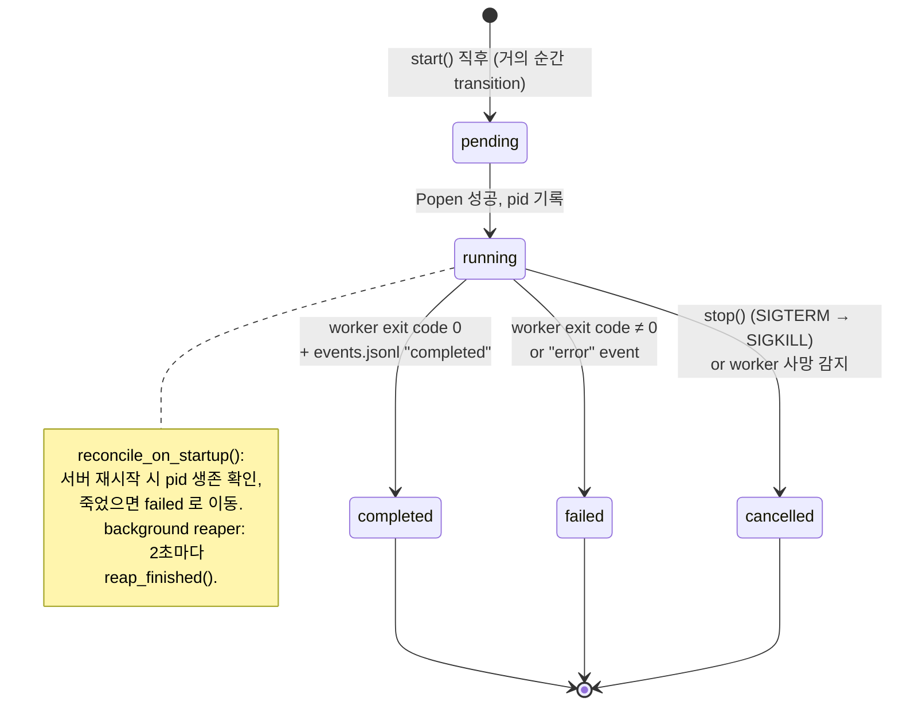
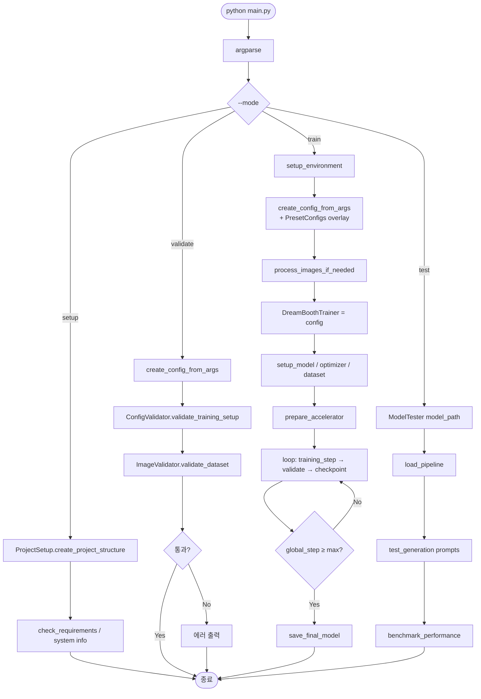

# UML Diagrams

모든 다이어그램은 Mermaid로 작성했습니다. GitHub, VS Code, Typora 등
Mermaid 렌더링을 지원하는 뷰어에서 그대로 열어볼 수 있습니다.

- [1. 컴포넌트(패키지) 다이어그램](#1-컴포넌트패키지-다이어그램)
- [2. 클래스 다이어그램 — 학습/추론 코어](#2-클래스-다이어그램--학습추론-코어)
- [3. 클래스 다이어그램 — API 레이어](#3-클래스-다이어그램--api-레이어)
- [4. 시퀀스 다이어그램 — 학습 시작부터 완료까지](#4-시퀀스-다이어그램--학습-시작부터-완료까지)
- [5. 시퀀스 다이어그램 — 이미지 생성 + SSE 스트리밍](#5-시퀀스-다이어그램--이미지-생성--sse-스트리밍)
- [6. 시퀀스 다이어그램 — 학습 중단](#6-시퀀스-다이어그램--학습-중단)
- [7. 상태 다이어그램 — Job lifecycle](#7-상태-다이어그램--job-lifecycle)
- [8. 플로우차트 — CLI 실행 모드](#8-플로우차트--cli-실행-모드)

---

## 1. 컴포넌트(패키지) 다이어그램

---

## 2. 클래스 다이어그램 — 학습/추론 코어

`backend/config.py`, `dataset.py`, `model.py`, `trainer.py`, `utils.py`.

---

## 3. 클래스 다이어그램 — API 레이어

`backend/api/**`. Pydantic 스키마는 대표적인 것만 표기했습니다.

```mermaid
classDiagram
    class FastAPIApp {
      +create_app() FastAPI
      +lifespan(app)
    }

    class Settings {
      <<module>>
      +Path BACKEND_DIR
      +Path DATA_ROOT
      +Path DATASETS_DIR
      +Path JOBS_DIR
      +Path MODELS_DIR
      +Path INFERENCE_DIR
      +str DEFAULT_PRETRAINED
      +List CORS_ORIGINS
      +int MAX_UPLOAD_BYTES
      +tuple ALLOWED_IMAGE_SUFFIXES
      +ensure_dirs()
    }

    class Paths {
      <<module>>
      +safe_component(name) str
      +safe_filename(name) str
      +resolve_under(base, *parts) Path
    }

    class UnsafePathError

    class StateIO {
      <<module>>
      +read_json(path, default) Any
      +write_json_atomic(path, data)
    }

    class EventLog {
      <<module>>
      +sse_frame(data, event) str
      +tail_jsonl(path, poll, heartbeat, is_alive) AsyncIterator
    }

    class Concurrency {
      <<module>>
      +active_gpu_job(request) Optional
      +require_gpu_free(request)
    }

    class GpuMod {
      <<module>>
      +init()
      +shutdown()
      +get_info(index) GPUInfo
    }

    class JobManager {
      -Path jobs_dir
      -Dict _procs
      -Lock _lock
      +job_dir(id) Path
      +event_log_path(id) Path
      +output_dir(id) Path
      +read_state(id) dict
      +write_state(id, state)
      +update_state(id, **fields) dict
      +start(cfg, dataset_id) dict
      +is_alive(id) bool
      +has_running_job() Optional~str~
      +stop(id, grace) dict
      +reap_finished()
      +list_jobs() List
      +reconcile_on_startup()
    }

    class InferenceManager {
      -Path base_dir
      -Dict _procs
      -Lock _lock
      +job_dir(id) Path
      +output_dir(id) Path
      +start(model_id, model_path, prompts, ...) dict
      +is_alive(id) bool
      +has_running_job() Optional~str~
      +stop(id, grace) dict
      +reap_finished()
      +_list_output_images(id) List
      +list_jobs() List
      +reconcile_on_startup()
    }

    class _RunningProc {
      +Popen popen
      +IO stdout_fp
    }

    class TrainRoutes {
      <<router>>
      +POST /api/train
      +GET  /api/train
      +GET  /api/train/:id
      +DELETE /api/train/:id
      +POST /api/train/:id/stop
      +GET  /api/train/:id/events  -- SSE
    }

    class InferenceRoutes {
      <<router>>
      +POST /api/inference/generate
      +GET  /api/inference
      +GET  /api/inference/:id
      +DELETE /api/inference/:id
      +POST /api/inference/:id/stop
      +GET  /api/inference/:id/events  -- SSE
      +GET  /api/inference/:id/images/:filename
    }

    class DatasetRoutes {
      <<router>>
      +GET /api/datasets
      +POST /api/datasets
      +GET /api/datasets/:id
      +POST /api/datasets/:id/images
      +DELETE /api/datasets/:id
    }

    class ModelsRoutes {
      <<router>>
      +GET /api/models
      +resolve_model(id) ModelInfo?
    }

    class TrainWorker {
      <<subprocess>>
      +main()
    }

    class InferWorker {
      <<subprocess>>
      +main()
    }

    class TrainStartRequest {
      +str dataset_id
      +str preset
      +str instance_prompt
      +str? class_prompt
      +int max_train_steps
      +float learning_rate
      +int resolution
      +bool use_lora
      +int lora_rank / lora_alpha
      +str mixed_precision
      +bool enable_vae_slicing / tiling
      +bool cpu_offload_text_encoder
      +bool with_prior_preservation
      +int seed
      +bool deterministic
    }

    class JobState {
      +str id
      +str status
      +float created_at / started_at / finished_at
      +int? pid / return_code
      +str? error
      +str? dataset_id / output_dir / event_log
      +int? max_train_steps / latest_step
      +float? latest_loss
    }

    class InferRequest {
      +str model_id
      +List~str~ prompts
      +str? negative_prompt
      +int num_inference_steps
      +float guidance_scale
      +int height / width
      +int num_images_per_prompt
      +int? seed
    }

    class InferJobState {
      +str id
      +str status
      +str model_id
      +float created_at / started_at / finished_at
      +List~str~ prompts
      +List~str~ images
      +int total_images
    }

    class ModelInfo {
      +str id
      +str? job_id
      +str path
      +str kind  (lora | full)
      +float created_at
    }

    FastAPIApp --> JobManager : owns (app.state)
    FastAPIApp --> InferenceManager : owns (app.state)
    FastAPIApp --> GpuMod : init/shutdown
    FastAPIApp --> Settings : ensure_dirs

    JobManager --> _RunningProc
    InferenceManager --> _RunningProc
    JobManager ..> StateIO : read/write
    InferenceManager ..> StateIO : read/write
    JobManager ..> Paths
    InferenceManager ..> Paths
    JobManager ..> Settings
    InferenceManager ..> Settings

    JobManager --> TrainWorker : spawns
    InferenceManager --> InferWorker : spawns

    TrainRoutes --> JobManager
    TrainRoutes ..> Concurrency
    TrainRoutes ..> EventLog : SSE
    TrainRoutes ..> TrainStartRequest
    TrainRoutes ..> JobState

    InferenceRoutes --> InferenceManager
    InferenceRoutes ..> Concurrency
    InferenceRoutes ..> EventLog : SSE
    InferenceRoutes ..> ModelsRoutes : resolve_model
    InferenceRoutes ..> InferRequest
    InferenceRoutes ..> InferJobState

    DatasetRoutes ..> Paths
    DatasetRoutes ..> StateIO
    DatasetRoutes ..> Settings

    ModelsRoutes ..> StateIO
    ModelsRoutes ..> Settings
    ModelsRoutes ..> ModelInfo

    Paths ..> UnsafePathError
```

---

## 4. 시퀀스 다이어그램 — 학습 시작부터 완료까지

---

## 5. 시퀀스 다이어그램 — 이미지 생성 + SSE 스트리밍

---

## 6. 시퀀스 다이어그램 — 학습 중단

---

## 7. 상태 다이어그램 — Job lifecycle

학습 / 추론 모두 동일한 상태 머신을 씁니다 (`schemas.JobState.status`,
`InferJobState.status`).

---

## 8. 플로우차트 — CLI 실행 모드

API를 거치지 않고 `python backend/main.py --mode ...`로 직접 실행할 때의
흐름입니다.

---

## 부록 — 이벤트 JSONL 스키마

워커가 `events.jsonl`에 append하는 레코드의 `type` 필드별 페이로드입니다.

| type | 필드 | 설명 |
|------|------|------|
| `start` | `ts`, `config` | 학습 시작. API는 프런트 초기화에 사용 |
| `step` | `ts`, `step`, `loss`, `lr`, `eta_seconds?` | 학습 스텝. API가 `JobManager.update_state()`로 `latest_step/loss` 갱신 |
| `validation` | `ts`, `step`, `images?` | 검증 이미지 생성 |
| `checkpoint` | `ts`, `step`, `path` | 체크포인트 저장 |
| `image` (추론) | `ts`, `filename`, `prompt_index`, `prompt` | 이미지 하나 생성 완료 |
| `progress` (추론) | `ts`, `done`, `total` | 전체 진행률 |
| `completed` | `ts`, … | **terminal** — SSE 스트림 종료 |
| `error` | `ts`, `error`, `error_type` | **terminal** |
| `cancelled` | `ts`, `reason?` | **terminal** — stop() 호출 또는 워커 비정상 종료 감지 |
| `__heartbeat__` | (내부용) | 15초 유휴 시 API가 생성. SSE 주석 프레임으로 변환되어 프록시 keepalive |

`_TERMINAL_TYPES = {"completed", "error", "cancelled"}` — `tail_jsonl`은
이 중 하나를 만나면 스트림을 닫아 `EventSource`가 재연결을 시도하지
않도록 합니다.
